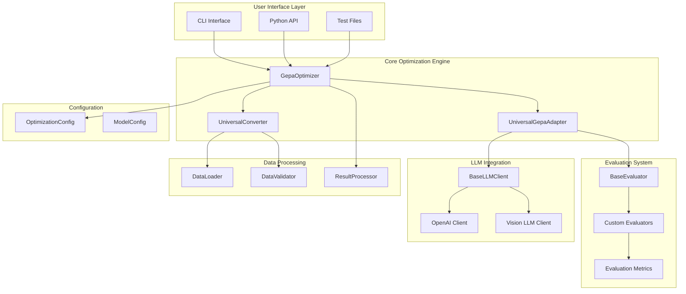
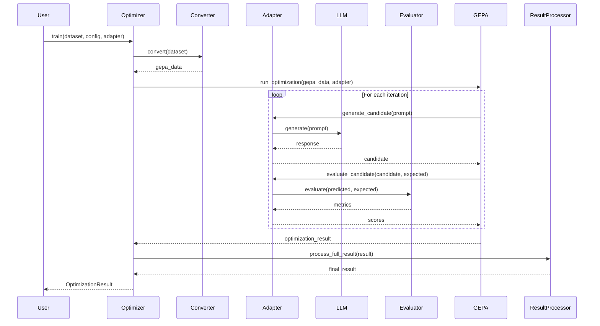
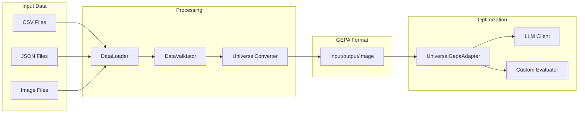
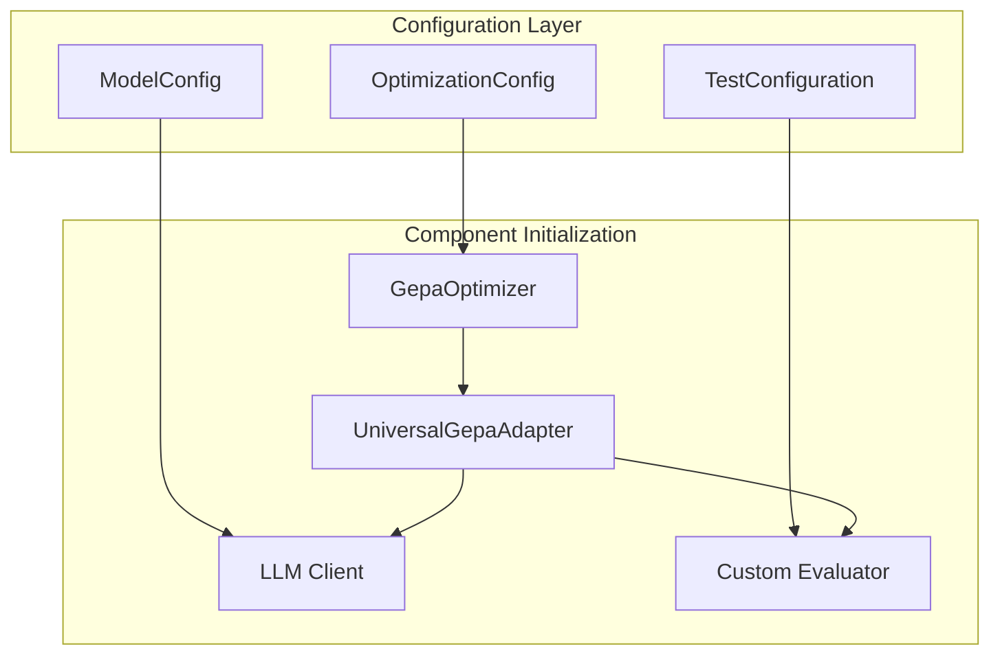
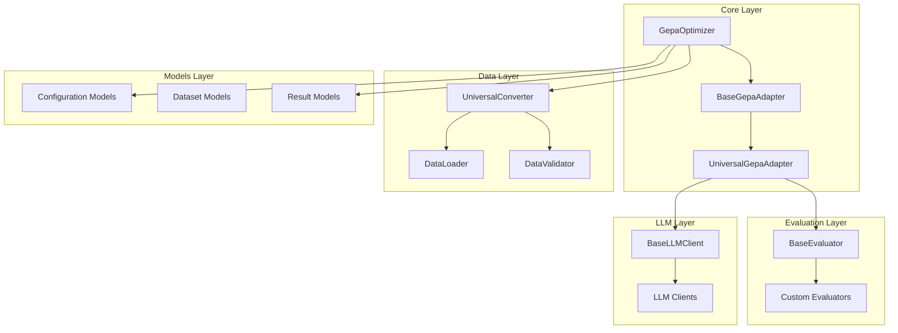

# 🏗️ GEPA Universal Prompt Optimizer - System Architecture

> **A comprehensive guide to understanding the complete system architecture, design patterns, and technical implementation of the GEPA Universal Prompt Optimizer.**

## 📋 Table of Contents

- [🏛️ Architectural Overview](#architectural-overview)
- [🔄 Core Workflow](#core-workflow)
- [🏗️ System Components](#system-components)
- [📊 Data Flow Architecture](#data-flow-architecture)
- [🔌 Component Interactions](#component-interactions)
- [📦 Module Structure](#module-structure)
- [⚡ Performance & Scalability](#performance--scalability)
- [🔧 Extension Points](#extension-points)

## 🏛️ Architectural Overview

The GEPA Universal Prompt Optimizer is built on a modular, extensible architecture that extends the base GEPA framework with universal adapters, custom evaluation systems, and multi-modal support.

### 🎯 Core Design Principles

1. **🔌 Universal Adapter Pattern**: Works with any LLM provider and use case
2. **📊 Custom Evaluation System**: Pluggable evaluation metrics for any domain
3. **🔄 Extensible Architecture**: Easy to add new components and features
4. **🛡️ Production Ready**: Error handling, logging, and security built-in
5. **⚡ Performance Optimized**: Async support and cost controls

### 🏗️ High-Level Architecture



## 🔄 Core Workflow

The optimization process follows a systematic workflow that extends the base GEPA framework:

### 1. 📥 **Data Input & Validation**
```python
# Data loading and validation
dataset = DataLoader.load_dataset(data_config)
validator = DataValidator()
validated_data = validator.validate(dataset)
```

### 2. 🔄 **Universal Conversion**
```python
# Convert to GEPA-compatible format
converter = UniversalConverter()
gepa_data = converter.convert(validated_data)
```

### 3. 🎯 **Optimization Execution**
```python
# Run GEPA optimization with universal adapter
optimizer = GepaOptimizer()
result = optimizer.train(
    dataset=gepa_data,
    config=optimization_config,
    adapter=universal_adapter
)
```

### 4. 📊 **Result Processing**
```python
# Process and structure results
processor = ResultProcessor()
final_result = processor.process_full_result(result)
```

## 🏗️ System Components

### 🎯 **Core Components**

#### **GepaOptimizer** (`gepa_optimizer/core/optimizer.py`)
- **Purpose**: Main entry point for optimization
- **Key Methods**:
  - `train()`: Orchestrates the complete optimization workflow
  - `_run_gepa_optimization()`: Executes GEPA optimization
  - `_log_pareto_front_info()`: Extracts iteration information

#### **UniversalGepaAdapter** (`gepa_optimizer/core/universal_adapter.py`)
- **Purpose**: Universal adapter for any use case
- **Key Features**:
  - Works with any `BaseLLMClient` and `BaseEvaluator`
  - Delegates to user-provided components
  - Handles candidate generation and evaluation

#### **UniversalConverter** (`gepa_optimizer/data/converters.py`)
- **Purpose**: Converts various data formats to GEPA-compatible format
- **Supported Formats**: CSV, JSON, UI tree datasets
- **Output Format**: Standardized `input`/`output`/`image` structure

### 📊 **Evaluation System**

#### **BaseEvaluator** (`gepa_optimizer/evaluation/base_evaluator.py`)
- **Purpose**: Abstract base class for all evaluators
- **Key Method**: `evaluate(predicted, expected) -> Dict[str, float]`
- **Required**: Must return `composite_score` for optimization

#### **Custom Evaluators**
- **UITreeEvaluator**: UI element extraction evaluation
- **CustomerServiceEvaluator**: Business-specific customer service metrics
- **TextGenerationEvaluator**: General text generation quality metrics

### 🔌 **LLM Integration**

#### **BaseLLMClient** (`gepa_optimizer/llms/base_llm.py`)
- **Purpose**: Abstract interface for LLM providers
- **Key Method**: `generate(prompt, **kwargs) -> str`

#### **VisionLLMClient** (`gepa_optimizer/llms/vision_llm.py`)
- **Purpose**: Multi-modal LLM support
- **Features**: Image + text processing, multiple providers

### 📦 **Data Management**

#### **DataLoader** (`gepa_optimizer/data/loaders.py`)
- **Purpose**: Load various file formats
- **Supported**: CSV, JSON, text, images, UI tree datasets

#### **ResultProcessor** (`gepa_optimizer/core/result.py`)
- **Purpose**: Process and structure optimization results
- **Features**: Extract metrics, format output, handle iterations

## 📊 Data Flow Architecture

### 🔄 **Optimization Data Flow**



### 📁 **Data Structure Flow**



## 🔌 Component Interactions

### 🎯 **Adapter Pattern Implementation**

The universal adapter pattern enables flexibility across different use cases:

```python
class UniversalGepaAdapter(BaseGepaAdapter):
    def __init__(self, llm_client: BaseLLMClient, evaluator: BaseEvaluator):
        self.llm_client = llm_client
        self.evaluator = evaluator
        self.converter = UniversalConverter()
    
    def evaluate(self, predicted: str, expected: str) -> float:
        """Delegate evaluation to user-provided evaluator"""
        metrics = self.evaluator.evaluate(predicted, expected)
        return metrics.get('composite_score', 0.0)
    
    def generate_candidate(self, prompt: str, **kwargs) -> str:
        """Delegate generation to user-provided LLM client"""
        return self.llm_client.generate(prompt, **kwargs)
```

### 🔄 **Configuration Flow**



## 📦 Module Structure

### 🏗️ **Directory Organization**

```
gepa_optimizer/
├── __init__.py              # Public API exports
├── core/                    # Core optimization engine
│   ├── optimizer.py         # Main GepaOptimizer class
│   ├── base_adapter.py      # Base adapter interface
│   ├── universal_adapter.py # Universal adapter implementation
│   ├── custom_adapter.py    # UI-specific adapter
│   └── result.py           # Result processing
├── data/                    # Data handling
│   ├── converters.py       # Universal data conversion
│   ├── loaders.py          # Data loading utilities
│   └── validators.py       # Data validation
├── evaluation/              # Evaluation system
│   ├── base_evaluator.py   # Base evaluator interface
│   ├── ui_evaluator.py     # UI tree evaluation
│   └── custom_evaluators.py # Domain-specific evaluators
├── llms/                    # LLM integration
│   ├── base_llm.py         # Base LLM interface
│   ├── openai_client.py    # OpenAI integration
│   └── vision_llm.py       # Multi-modal LLM support
├── models/                  # Data models
│   ├── config.py           # Configuration models
│   ├── dataset.py          # Dataset models
│   └── result.py           # Result models
└── utils/                   # Utilities
    ├── api_keys.py         # API key management
    ├── logging.py          # Logging utilities
    └── exceptions.py       # Custom exceptions
```

### 🔗 **Dependency Relationships**



## ⚡ Performance & Scalability

### 🚀 **Performance Optimizations**

1. **🔄 Async Support**: Non-blocking LLM API calls
2. **📊 Batch Processing**: Efficient data handling
3. **💾 Caching**: Result caching for repeated evaluations
4. **⚡ Early Stopping**: Configurable stopping criteria
5. **💰 Cost Controls**: Budget limits and usage tracking

### 📈 **Scalability Considerations**

1. **🔌 Modular Design**: Easy to add new components
2. **📊 Configurable Limits**: Adjustable iteration and budget limits
3. **🔄 Parallel Processing**: Support for concurrent evaluations
4. **💾 Memory Management**: Efficient data structure handling
5. **🌐 Distributed Support**: Ready for distributed optimization

## 🔧 Extension Points

### 🎯 **Adding New Components**

#### **1. Custom Evaluators**
```python
class MyCustomEvaluator(BaseEvaluator):
    def evaluate(self, predicted: str, expected: str) -> Dict[str, float]:
        # Implement your evaluation logic
        return {
            "custom_metric": score,
            "composite_score": weighted_score
        }
```

#### **2. Custom LLM Clients**
```python
class MyLLMClient(BaseLLMClient):
    def generate(self, prompt: str, **kwargs) -> str:
        # Implement your LLM integration
        return response
```

#### **3. Custom Data Converters**
```python
class MyDataConverter:
    def convert(self, data: Any) -> List[Dict]:
        # Convert your data format to GEPA format
        return converted_data
```

### 🔌 **Integration Points**

1. **🎯 Adapter Extension**: Extend `BaseGepaAdapter` for custom workflows
2. **📊 Evaluation Extension**: Implement `BaseEvaluator` for domain-specific metrics
3. **🔌 LLM Extension**: Add new providers via `BaseLLMClient`
4. **📁 Data Extension**: Support new formats via custom converters
5. **⚙️ Configuration Extension**: Add new configuration options

---

## 🎯 **Key Takeaways**

1. **🏗️ Modular Architecture**: Clean separation of concerns with extensible components
2. **🔌 Universal Design**: Works with any LLM provider and use case
3. **📊 Flexible Evaluation**: Pluggable evaluation system for any domain
4. **⚡ Production Ready**: Built-in error handling, logging, and security
5. **🚀 Extensible**: Easy to add new features and components

This architecture enables the GEPA Universal Prompt Optimizer to be a powerful, flexible, and production-ready tool for prompt optimization across diverse use cases and domains.
