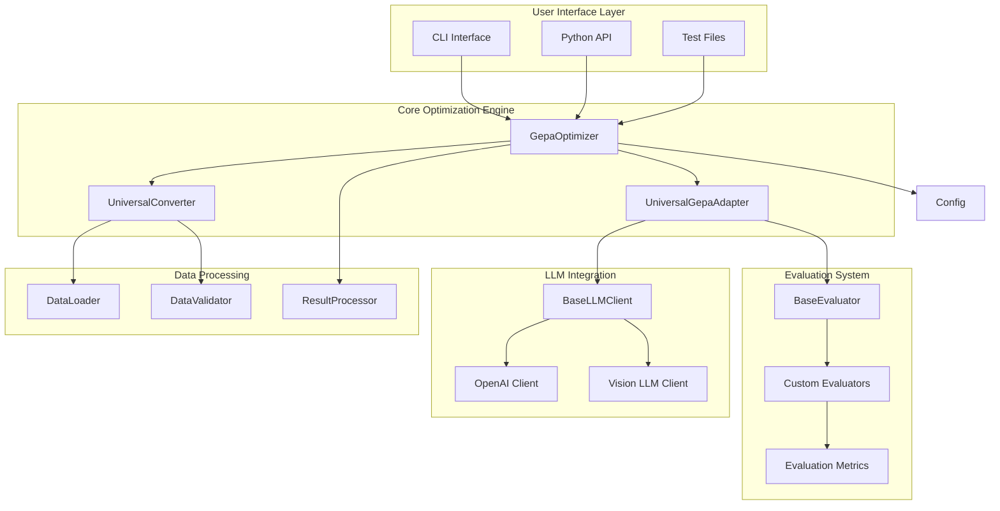

# 🏗️ Architecture

This section provides comprehensive documentation about the GEPA Universal Prompt Optimizer's system architecture, design patterns, and technical implementation.

## 📋 What's in this section

- [System Overview](system-overview.md) - Complete system architecture and design patterns
- [Component Design](component-design.md) - Detailed component breakdown and interactions
- [Data Flow](data-flow.md) - How data flows through the optimization process

## 🎯 Architecture Overview

The GEPA Universal Prompt Optimizer is built on a modular, extensible architecture that extends the base GEPA framework with:

- **🔌 Universal Adapter Pattern**: Works with any LLM provider and use case
- **📊 Custom Evaluation System**: Pluggable evaluation metrics for any domain
- **🔄 Extensible Architecture**: Easy to add new components and features
- **🛡️ Production Ready**: Error handling, logging, and security built-in
- **⚡ Performance Optimized**: Async support and cost controls

## 🏗️ High-Level Architecture

## 🔑 Key Design Principles

### 1. **Modularity**
- Clean separation of concerns
- Pluggable components
- Easy to extend and modify

### 2. **Universality**
- Works with any LLM provider
- Supports any use case
- Flexible evaluation system

### 3. **Production Ready**
- Comprehensive error handling
- Detailed logging and monitoring
- Security and cost controls

### 4. **Performance**
- Async support for scalability
- Efficient data processing
- Optimized API usage

## 📦 Core Components

### **GepaOptimizer**
- Main entry point for optimization
- Orchestrates the complete workflow
- Manages configuration and results

### **UniversalGepaAdapter**
- Universal adapter for any use case
- Delegates to user-provided components
- Handles candidate generation and evaluation

### **UniversalConverter**
- Converts various data formats
- Standardizes data for GEPA processing
- Supports CSV, JSON, and UI tree datasets

### **BaseEvaluator**
- Abstract base for all evaluators
- Enforces consistent evaluation interface
- Enables custom domain-specific metrics

### **BaseLLMClient**
- Abstract interface for LLM providers
- Supports multiple providers
- Handles API calls and error management

## 🔄 Data Flow

1. **Data Input** → Load and validate dataset
2. **Conversion** → Convert to GEPA-compatible format
3. **Optimization** → Run GEPA optimization with universal adapter
4. **Evaluation** → Use custom evaluators for scoring
5. **Result Processing** → Extract and structure results

## 🎯 Extension Points

- **Custom Evaluators**: Implement `BaseEvaluator` for domain-specific metrics
- **Custom LLM Clients**: Extend `BaseLLMClient` for new providers
- **Custom Adapters**: Create specialized adapters for specific use cases
- **Custom Converters**: Add support for new data formats
- **Custom Configurations**: Extend configuration options

## 🚀 Getting Started

- **New to the architecture?** → Start with [System Overview](system-overview.md)
- **Want to understand components?** → Read [Component Design](component-design.md)
- **Need to trace data flow?** → Check [Data Flow](data-flow.md)
- **Ready to extend?** → See [Contributing](../contributing/)

## 🔗 Related Resources

- [Getting Started](../getting-started/) - Installation and basic usage
- [Tutorials](../tutorials/) - Real-world examples
- [API Reference](../api-reference/) - Complete API documentation
- [Examples](../examples/) - Code examples and patterns
