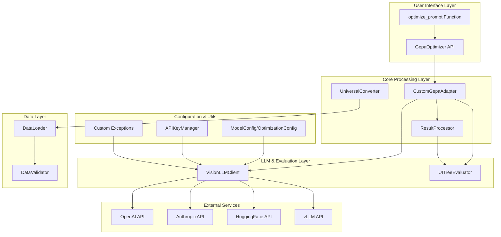
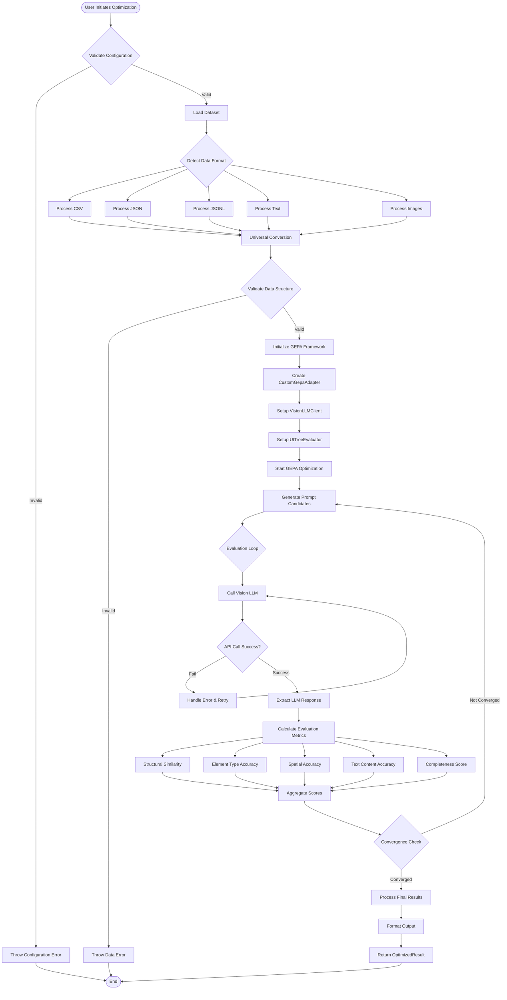
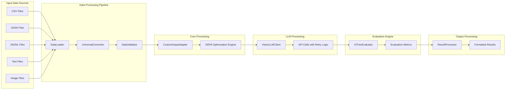
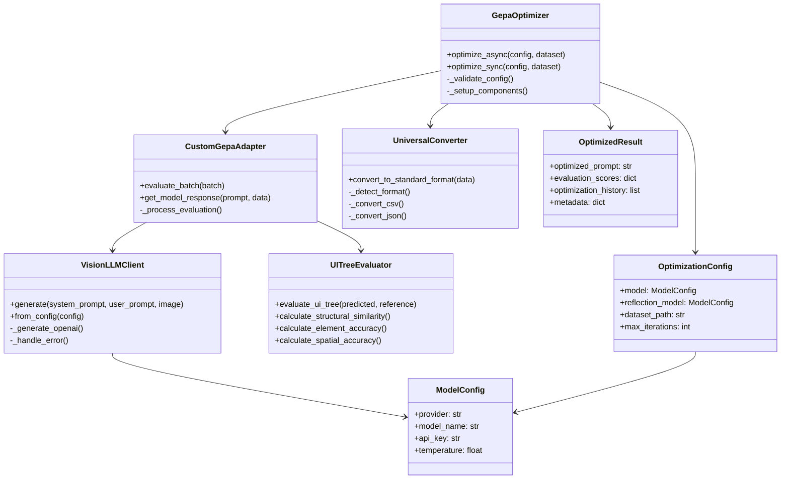
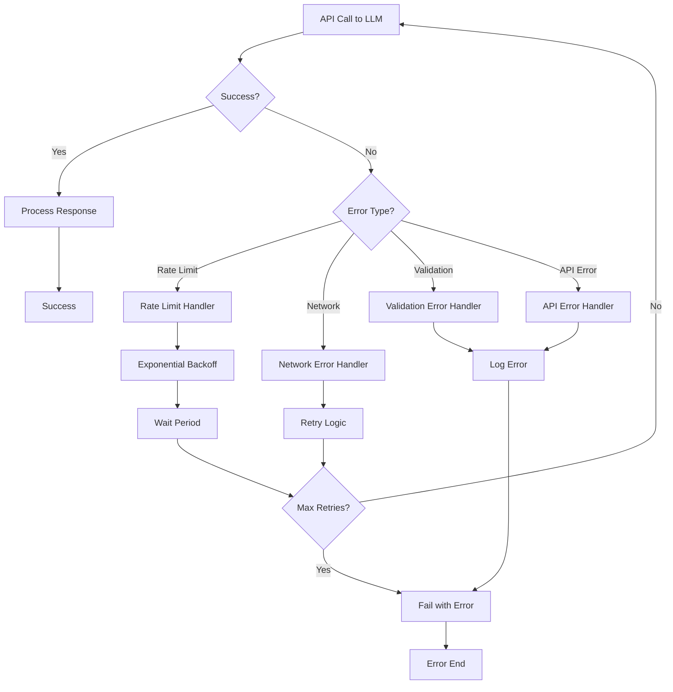
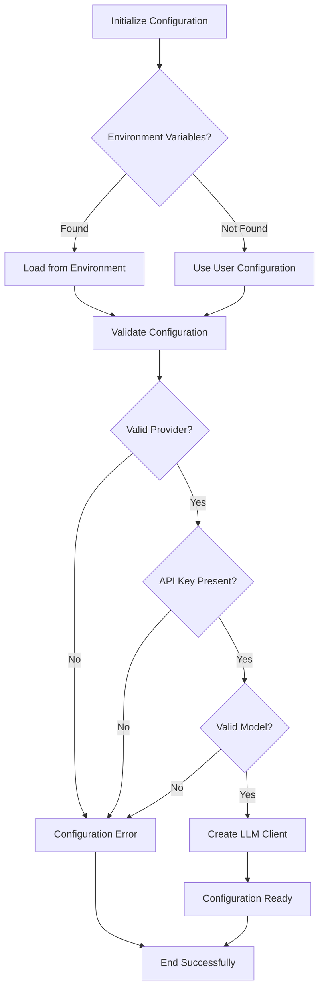

# GEPA Universal Prompt Optimizer - Architecture & Workflow Diagrams

## 1. High-Level Architecture Overview

## 2. Detailed Workflow - Prompt Optimization Process

## 3. Data Flow Architecture

## 4. Class Relationship Diagram

## 5. Error Handling Flow

## 6. Configuration Management Flow

