# GEPA Universal Prompt Optimizer - Clean Architecture Diagram

## Complete System Architecture

```mermaid
graph TB
    %% User Interface Layer
    subgraph "🎯 User Interface Layer"
        USER[👤 User]
        API[GepaOptimizer API]
        CONV[optimize_prompt Function]
    end
    
    %% Core Processing Layer
    subgraph "⚙️ Core Processing Layer"
        OPTIMIZER[GepaOptimizer]
        ADAPTER[CustomGepaAdapter]
        PROCESSOR[ResultProcessor]
    end
    
    %% Data Processing Pipeline
    subgraph "📊 Data Processing Pipeline"
        CONVERTER[UniversalConverter]
        LOADER[DataLoader]
        VALIDATOR[DataValidator]
    end
    
    %% LLM & Evaluation Engine
    subgraph "🤖 LLM & Evaluation Engine"
        LLM[VisionLLMClient]
        EVALUATOR[UITreeEvaluator]
        METRICS[Evaluation Metrics]
    end
    
    %% Configuration Management
    subgraph "⚙️ Configuration Management"
        CONFIG[OptimizationConfig]
        MODEL_CONFIG[ModelConfig]
        API_KEYS[APIKeyManager]
    end
    
    %% External LLM Providers
    subgraph "🌐 External LLM Providers"
        OPENAI[OpenAI GPT-4V]
        ANTHROPIC[Anthropic Claude-3]
        HF[HuggingFace Models]
        VLLM[vLLM Endpoints]
    end
    
    %% GEPA Framework
    subgraph "🧠 GEPA Framework"
        GEPA_ENGINE[GEPA Optimization Engine]
        CANDIDATES[Prompt Candidates]
        RANKING[Candidate Ranking]
    end
    
    %% Data Flow Connections
    USER --> API
    USER --> CONV
    CONV --> API
    API --> OPTIMIZER
    
    OPTIMIZER --> CONVERTER
    OPTIMIZER --> ADAPTER
    OPTIMIZER --> CONFIG
    
    CONVERTER --> LOADER
    CONVERTER --> VALIDATOR
    
    ADAPTER --> LLM
    ADAPTER --> EVALUATOR
    ADAPTER --> GEPA_ENGINE
    
    LLM --> OPENAI
    LLM --> ANTHROPIC
    LLM --> HF
    LLM --> VLLM
    
    EVALUATOR --> METRICS
    METRICS --> ADAPTER
    
    CONFIG --> MODEL_CONFIG
    CONFIG --> API_KEYS
    MODEL_CONFIG --> LLM
    API_KEYS --> LLM
    
    GEPA_ENGINE --> CANDIDATES
    CANDIDATES --> RANKING
    ADAPTER --> GEPA_ENGINE
    RANKING --> GEPA_ENGINE
    
    ADAPTER --> PROCESSOR
    PROCESSOR --> API
    
    %% Styling
    classDef userLayer fill:#e1f5fe,stroke:#01579b,stroke-width:2px
    classDef coreLayer fill:#f3e5f5,stroke:#4a148c,stroke-width:2px
    classDef dataLayer fill:#e8f5e8,stroke:#1b5e20,stroke-width:2px
    classDef llmLayer fill:#fff3e0,stroke:#e65100,stroke-width:2px
    classDef configLayer fill:#fce4ec,stroke:#880e4f,stroke-width:2px
    classDef externalLayer fill:#f1f8e9,stroke:#33691e,stroke-width:2px
    classDef gepaLayer fill:#e0f2f1,stroke:#004d40,stroke-width:2px
    
    class USER,API,CONV userLayer
    class OPTIMIZER,ADAPTER,PROCESSOR coreLayer
    class CONVERTER,LOADER,VALIDATOR dataLayer
    class LLM,EVALUATOR,METRICS llmLayer
    class CONFIG,MODEL_CONFIG,API_KEYS configLayer
    class OPENAI,ANTHROPIC,HF,VLLM externalLayer
    class GEPA_ENGINE,CANDIDATES,RANKING gepaLayer
```

## Detailed Component Flow

## Data Structure Flow

```mermaid
flowchart LR
    subgraph "Input Data Formats"
        CSV["📊 CSV Files<br/>user_input,expected_output"]
        JSON["📄 JSON Files<br/>{input: '', output: ''}"]
        JSONL["📝 JSONL Files<br/>Line-by-line JSON"]
        IMG["🖼️ Images<br/>PNG, JPG, JPEG"]
        TXT["📃 Text Files<br/>Raw text content"]
    end
    
    subgraph "Standardization Process"
        DETECT[🔍 Format Detection]
        EXTRACT[📤 Key Extraction<br/>input/output/image]
        STANDARD["📋 Standard Format<br/>{input: str, output: str, image: str}"]
    end
    
    subgraph "GEPA Processing"
        SPLIT[✂️ Train/Val Split]
        CANDIDATES[🎯 Prompt Candidates]
        EVALUATION[📊 Batch Evaluation]
    end
    
    subgraph "LLM Processing"
        VISION_CALL[👁️ Vision LLM Call<br/>system_prompt + user_prompt + image]
        UI_TREE[🌳 Generated UI Tree JSON]
        SCORING[📈 Quality Scoring<br/>5 metrics → composite score]
    end
    
    subgraph "Output Results"
        RANKING[🏆 Candidate Ranking]
        BEST[⭐ Best Prompt]
        METRICS_OUT[📊 Performance Metrics]
        RESULT[📋 OptimizedResult]
    end
    
    CSV --> DETECT
    JSON --> DETECT
    JSONL --> DETECT
    IMG --> DETECT
    TXT --> DETECT
    
    DETECT --> EXTRACT
    EXTRACT --> STANDARD
    STANDARD --> SPLIT
    
    SPLIT --> CANDIDATES
    CANDIDATES --> EVALUATION
    EVALUATION --> VISION_CALL
    
    VISION_CALL --> UI_TREE
    UI_TREE --> SCORING
    SCORING --> RANKING
    
    RANKING --> BEST
    RANKING --> METRICS_OUT
    BEST --> RESULT
    METRICS_OUT --> RESULT
```

## Evaluation Metrics Breakdown

## Error Handling & Retry Logic

